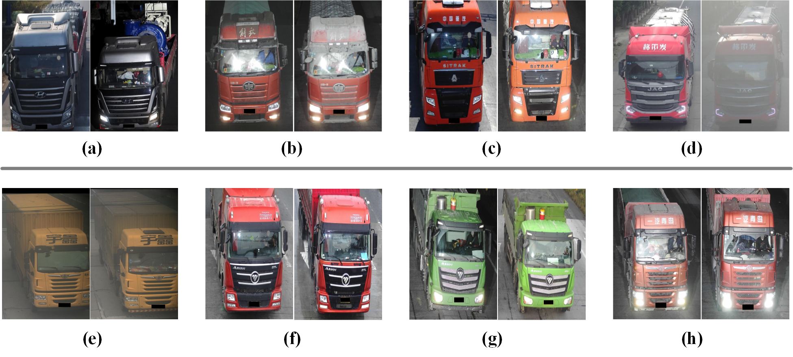

## Joint Image and Feature Level Disentanglement for Generalizable Vehicle Re-Identification

### Usage
- This project is based on the strong person re-identification baseline: Bag of Tricks[3] ([paper](https://openaccess.thecvf.com/content_CVPRW_2019/papers/TRMTMCT/Luo_Bag_of_Tricks_and_a_Strong_Baseline_for_Deep_Person_CVPRW_2019_paper.pdf) and [official code](https://github.com/michuanhaohao/reid-strong-baseline)).


- This project is based on the Domain agnostic learning with disentangled representations[5] ([paper](http://proceedings.mlr.press/v97/peng19b/peng19b.pdf) and [official code](https://github.com/VisionLearningGroup/DAL/tree/19d74cc89a63664a45e79f9aebff32e7dc7bcea1)).

- This package contains the source code which is associated with the following paper:
```
Zhenyu Kuang, Chuchu He, Yue Huang, Xinghao Ding and Huafeng Li. Joint Image and Feature Level Disentanglement for Generalizable Vehicle Re-Identification. 
```
- Usage of this code is free for research purposes only. 

### Installation
- The model is learned by pytorch. See Bag of Tricks[3] for more Settings.

### Prepare Datasets
- Download the original dataset from [VeRi-776](https://vehiclereid.github.io/VeRi/)[1] and [VehicleX](https://github.com/yorkeyao/VehicleX)[4] and [Opri](https://github.com/KZYYYY/JIFD).

### Train.  
(1)Please replace dataset path with your own path, see 'defaults.py' for more details.    
(2)To begin training.(See the code for more details)

```
If the paper is accepted, the training code will be made public immediately.
```
### Test.   
(1)To begin testing.(See the code for more details)  

```
python test.py
```

(2)You can download the above models in the paper from [Google Drive](https://drive.google.com/drive/folders/15GtYcUJzjMJawhcIKX1xaDUUoUUNpMke?usp=sharing) (or  [Baidu Disk](https://pan.baidu.com/s/1SJJvFnCJFMa4qMK1QP8Gfg) password:2022 for VeRi776→Opri and VehicleX→Opri).( Useing to verify the effectiveness of the proposed method).


### Dataset in This Paper ( It is for research purposes only. )

- Download the original dataset from [VeRi-776](https://vehiclereid.github.io/VeRi/)[1] and [VehicleX](https://github.com/yorkeyao/VehicleX)[4] and [Opri](https://github.com/KZYYYY/JIFD).

**Description of Opri**: We build a fine-grained vehicle dataset "Optimus Prime (Opri)", which is composed entirely of truck images. The dataset collects a total of 130,994 images of 17,835 trucks, which are captured by a network of cameras at highway toll booths. And all the images collected by the Opri dataset are 4K resolution. The following figure  shows sample images of the Opri dataset. Each vehicle has at least two images in our dataset. The first row shows significant intra-instance differences for the same vehicles, which originate from changes in vehicle appearance and light intensity. Images in the second row all come from different vehicle identities with similar appearance and show slight inter-instance differences of similar vehicles. License plates and faces are obscured due to privacy.



### Contact
- If you have any questions, please feel free to contact me. [kmustkzy@126.com](kmustkzy@126.com) . 

### Reference
```
[1]Liu X, Liu W, Mei T, et al. A deep learning-based approach to progressive vehicle re-identification for urban surveillance[C]//European conference on computer vision. Springer, Cham, 2016: 869-884.  
[2]K. Yang, T. Zhou, Y. Zhang, X. Tian, and D. Tao, “Class-disentanglement and applications in adversarial detection and defense,” in Advances in Neural Information Processing Systems (NeurlPS), 2021.
[3]Luo H, Gu Y, Liao X, et al. Bag of tricks and a strong baseline for deep person re-identification[C]//Proceedings of the IEEE/CVF Conference on Computer Vision and Pattern Recognition Workshops. 2019: 0-0.
[4]M. Naphade, S. Wang, B. Anastasiu, Z. Tang, M. Chang, X. Yang, L. Zheng, A. Sharma, R. Chellappa, and P. Chakraborty, “The 4th ai city challenge,” in IEEE Conference on Computer Vision and Pattern
Recognition (CVPR), 2020
[5]Peng X, Huang Z, Sun X, et al. Domain agnostic learning with disentangled representations[C]//International Conference on Machine Learning. PMLR, 2019: 5102-5112.
```
